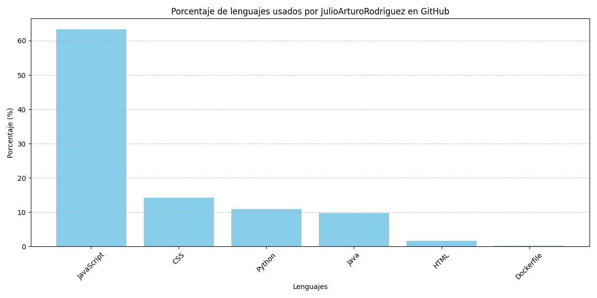
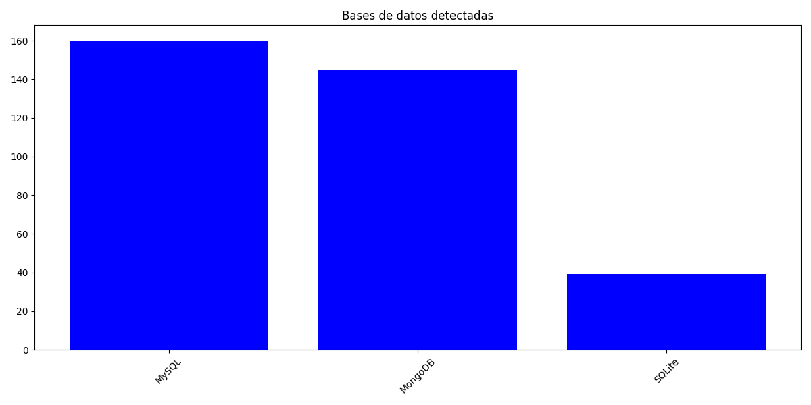
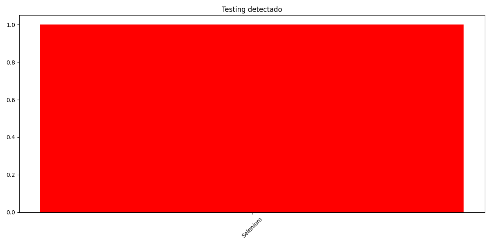
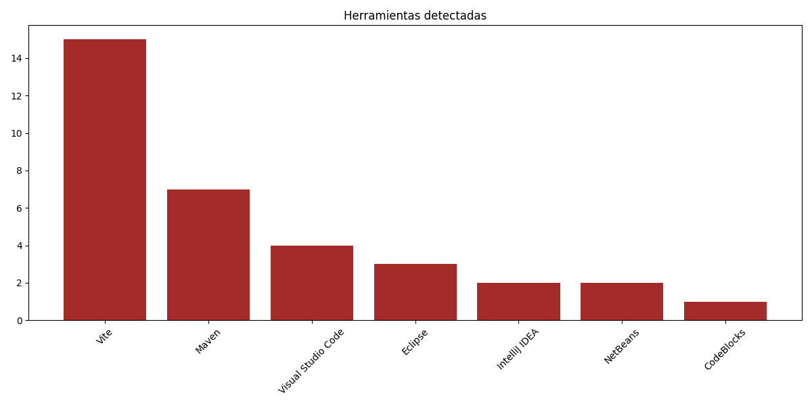

<h1 align="center"><b> Hola Soy Julio Arturo Rodríguez </b></h1>

Gracias por tomarte el tiempo de leer esto y darme la oportunidad de presentarme.  
Mi perfil es multidisciplinario con orientación full stack MERN, con conocimientos en diversas áreas de IT: desarrollo web, testing, soporte técnico, hardware, diseño UX/UI, administración con informática,  análisis funcional, base de datos, aplicaciones de escritorio.

---

## 🛠️ Habilidades clave

### 💻 Lenguajes

### 🚀 Frameworks y Librerías

     

### 🗄️ Bases de datos  

### 🧠 Desarrollo de software
`Arquitectura MVC`, `Microservicios`, `RESTful APIs`, `Backend y Frontend`

### 🧪 Testing

<h3>🛠️ Herramientas</h3>

### 🛠️ Herramientas de Construcción y Generación de Proyectos

### ☁️ Cloud Hosting

### 🎨 Otros
`UX/UI`, `Marketing digital`, `Componentes de hardware`, `Linux`, `Windows`

---

## 🎓 Formación y certificaciones

Cuento con formación respaldada por programas nacionales y centros de formación profesional, todos con certificación oficial de validez nacional:

<h2>🎓 Formación y certificaciones</h2>

Cuento con formación respaldada por programas nacionales y centros de formación profesional, todos con certificación oficial de validez nacional:

<h3>📘 Diplomaturas cursadas:</h3>

<ul>
  <li>
     <strong>Codo a Codo 4.0</strong>
  </li>
  <li>
     <strong>Talento Tech</strong>
  </li>
  <li>
     <strong>UTN - Universidad Tecnológica Nacional</strong>
  </li>
  <li>
     <strong>Argentina Programa 1 y 2</strong>
  </li>
</ul>

<h3>🧪 Certificaciones prácticas avaladas por:</h3>

<ul>
  <li>
     <strong>INET</strong> – Instituto Nacional de Educación Tecnológica
  </li>
  <li>
     <strong>UOM</strong> – Unión Obrera Metalúrgica
  </li>
  <li>
     <strong>SEDUCA</strong> – Sindicato de Educadores
  </li>
</ul>

🎯 <strong>Actualmente:</strong> 
Curso el segundo cuatrimestre de una diplomatura en <strong>Desarrollo de Software con orientación práctica</strong>, enfocada en herramientas reales de la industria.

<h2>🏫 Instituciones educativas y centros de formación</h2>

He desarrollado mi formación a través de diversas instituciones educativas y programas especializados, tanto en educación formal como no formal, en áreas técnicas, tecnológicas y lingüísticas:

<h3>🏛️ Formación técnica y profesional</h3>
<ul>
  <li>
    
    <strong> Instituto de Formación Técnica Superior N.º 11 (IFTS 11)</strong> – Formación en tecnología aplicada, con orientación práctica y certificación oficial.
  </li>
  <li>
    
    <strong> Centro Universitario de González Catán (CUDI)</strong> – Participación en programas de capacitación universitaria descentralizada.
  </li>
  <li>
    
    <strong> Centro de Formación Profesional N.º 31 (CFP 31)</strong> – Cursos de capacitación técnica en entornos productivos, avalados por el INET.
  </li>
  <li>
    
    <strong> Centro de Formación Profesional N.º 406 – La Matanza</strong> – Capacitación técnica e industrial con validez nacional.
  </li>
</ul>

<h3>🌐 Educación no formal y programas lingüísticos</h3>
<ul>
  <li>
    
    <strong> Ciudad Bilingüe</strong> – Programa de formación en idiomas enfocado en competencias comunicativas en inglés.
  </li>
  <li>
    
    <strong> CUI Idiomas – Centro Universitario de Idiomas</strong> – Cursos de inglés general y técnico en diferentes niveles.
  </li>
</ul>

<h3>🏛️ Universidades e instituciones complementarias</h3>
<ul>
  <li>
    
    <strong> UTN – Universidad Tecnológica Nacional</strong> – Diplomaturas y cursos especializados en desarrollo de software y tecnologías aplicadas.
  </li>
</ul>

---

## 🎯 Enfoque actual y objetivos

Me inclino más por el desarrollo **web** y **Movil**, donde puedo aplicar mis conocimientos técnicos y creativos.  
Sin embargo, me gusta explorar distintas áreas del mundo IT. Actualmente, tengo interés en **aprender sobre ciberseguridad** para mejorar mis buenas prácticas de desarrollo, fortalecer mi código y tener en cuenta aspectos críticos de protección de datos y sistemas.

Estoy cursando una **tecnicatura en desarrollo de software**, que planeo finalizar entre **2027 y 2028**.  
Mi formación comenzó como un hobby, pero se convirtió en una pasión con visión a largo plazo. Me interesa seguir desarrollando habilidades tanto técnicas como funcionales.

---

<h3 align="center">
  
  Conéctate conmigo 🤝
</h3>

  
  
  
  

<h2 align="center">📁 Proyectos Educativos Destacados</h2>

  
    

  
    

  
    

  
    

  

---
---
## 📊 Estadísticas

### 📌 Lenguajes que uso en GitHub (actualizado cada 24 horas)

### 📄 Ranking en texto  
(Se actualiza automáticamente)
<!-- AUTO-LANGUAGES -->
## 📊 Lenguajes más usados (actualizado automáticamente)

- **JavaScript**: 65.6%
- **CSS**: 14.77%
- **Java**: 10.09%
- **Python**: 7.72%
- **HTML**: 1.69%
- **Dockerfile**: 0.13%
## 📊 Lenguajes más usados (actualizado automáticamente)

- **JavaScript**: 65.87%
- **CSS**: 14.83%
- **Java**: 10.13%
- **Python**: 7.34%
- **HTML**: 1.7%
- **Dockerfile**: 0.13%

## 📊 Frameworks

<!-- AUTO-FRAMEWORKS -->
## Frameworks detectados (Front + Back + ML/DL)

- **React**: 194 apariciones (~43.7%)
- **Express**: 100 apariciones (~22.5%)
- **TensorFlow**: 50 apariciones (~11.3%)
- **Keras**: 50 apariciones (~11.3%)
- **Scikit-Learn**: 50 apariciones (~11.3%)
## Frameworks detectados automáticamente (solo código real)

- **CSS3**: 1040 apariciones en código
- **JSX/TSX**: 660 apariciones en código
- **React**: 140 apariciones en código
- **HTML5**: 100 apariciones en código
- **Express**: 40 apariciones en código
- **ReactDOM**: 20 apariciones en código
- **React Router**: 20 apariciones en código
- **Bootstrap**: 20 apariciones en código
- **NumPy**: 20 apariciones en código
- **Pandas**: 20 apariciones en código
- **Matplotlib**: 20 apariciones en código
- **Scikit-Learn**: 20 apariciones en código
- **TensorFlow**: 20 apariciones en código
- **Keras**: 20 apariciones en código
- **Mongoose**: 20 apariciones en código
## Frameworks detectados automáticamente (solo código real)

- **CSS3**: 520 apariciones en código
- **JSX/TSX**: 330 apariciones en código
- **React**: 70 apariciones en código
- **HTML5**: 50 apariciones en código
- **Express**: 20 apariciones en código
- **ReactDOM**: 10 apariciones en código
- **React Router**: 10 apariciones en código
- **Bootstrap**: 10 apariciones en código
- **NumPy**: 10 apariciones en código
- **Pandas**: 10 apariciones en código
- **Matplotlib**: 10 apariciones en código
- **Scikit-Learn**: 10 apariciones en código
- **TensorFlow**: 10 apariciones en código
- **Keras**: 10 apariciones en código
- **Mongoose**: 10 apariciones en código
## Frameworks detectados automáticamente (solo código real)

- **JSX/TSX**: 489 apariciones en código
- **CSS3**: 264 apariciones en código
- **React**: 32 apariciones en código
- **Bootstrap**: 9 apariciones en código
- **Matplotlib**: 9 apariciones en código
- **Spring Security**: 7 apariciones en código
- **Spring Data JPA**: 7 apariciones en código
- **Express**: 7 apariciones en código
- **HTML5**: 6 apariciones en código
- **JavaScript Vanilla**: 6 apariciones en código
- **JWT**: 6 apariciones en código
- **Spring Web**: 5 apariciones en código
- **ReactDOM**: 5 apariciones en código
- **React Router**: 5 apariciones en código
- **React-Bootstrap**: 5 apariciones en código
- **Mongoose**: 5 apariciones en código
- **Hibernate**: 3 apariciones en código
- **Bcrypt**: 3 apariciones en código
- **Spring Boot**: 2 apariciones en código
- **Lombok**: 1 apariciones en código
- **NumPy**: 1 apariciones en código
- **Pandas**: 1 apariciones en código
- **Scikit-Learn**: 1 apariciones en código
- **TensorFlow**: 1 apariciones en código
- **Keras**: 1 apariciones en código
## Frameworks detectados automáticamente (solo código real)

- **Matplotlib**: 9 apariciones en código
- **Spring Security**: 7 apariciones en código
- **Spring Data JPA**: 7 apariciones en código
- **Express**: 7 apariciones en código
- **JWT**: 6 apariciones en código
- **Spring Web**: 5 apariciones en código
- **Mongoose**: 5 apariciones en código
- **Hibernate**: 3 apariciones en código
- **Bcrypt**: 3 apariciones en código
- **Spring Boot**: 2 apariciones en código
- **Lombok**: 1 apariciones en código
- **NumPy**: 1 apariciones en código
- **Pandas**: 1 apariciones en código
- **Scikit-Learn**: 1 apariciones en código
- **TensorFlow**: 1 apariciones en código
- **Keras**: 1 apariciones en código
## Frameworks detectados automáticamente (solo código real)

- **Matplotlib**: 9 apariciones en código
- **Spring Security**: 7 apariciones en código
- **Spring Data JPA**: 7 apariciones en código
- **Express**: 7 apariciones en código
- **JWT**: 6 apariciones en código
- **Spring Web**: 5 apariciones en código
- **Mongoose**: 5 apariciones en código
- **Hibernate**: 3 apariciones en código
- **Bcrypt**: 3 apariciones en código
- **Spring Boot**: 2 apariciones en código
- **Lombok**: 1 apariciones en código
- **NumPy**: 1 apariciones en código
- **Pandas**: 1 apariciones en código
- **Scikit-Learn**: 1 apariciones en código
- **TensorFlow**: 1 apariciones en código
- **Keras**: 1 apariciones en código
## Frameworks detectados automáticamente (solo código real)

- **Matplotlib**: 9 apariciones en código
- **Spring Security**: 7 apariciones en código
- **Spring Data JPA**: 7 apariciones en código
- **Express**: 7 apariciones en código
- **JWT**: 6 apariciones en código
- **Spring Web**: 5 apariciones en código
- **Mongoose**: 5 apariciones en código
- **Hibernate**: 3 apariciones en código
- **Bcrypt**: 3 apariciones en código
- **Spring Boot**: 2 apariciones en código
- **Lombok**: 1 apariciones en código
- **NumPy**: 1 apariciones en código
- **Pandas**: 1 apariciones en código
- **Scikit-Learn**: 1 apariciones en código
- **TensorFlow**: 1 apariciones en código
- **Keras**: 1 apariciones en código
## Frameworks detectados automáticamente (solo código real)

- **Spring Data JPA**: 7 apariciones en código
- **Spring Web**: 5 apariciones en código
- **Spring Security**: 5 apariciones en código
- **Hibernate**: 3 apariciones en código
- **Spring Boot**: 1 apariciones en código
- **Lombok**: 1 apariciones en código
## Frameworks detectados automáticamente (solo código real)

No se detectaron frameworks.
## Frameworks detectados automáticamente (solo código real)

No se detectaron frameworks.
## Frameworks detectados automáticamente (solo código real)

No se detectaron frameworks.
## Frameworks detectados automáticamente

- **React**: 200 repos
- **Express**: 82 repos
- **Vue**: 61 repos
- **Flask**: 51 repos
- **Django**: 48 repos
- **Angular**: 47 repos
- **Spring**: 30 repos
- **Laravel**: 27 repos
- **FastAPI**: 6 repos

## 📊 Librerías

<!-- AUTO-LIBRARIES -->

## 📊 Bases de datos

<!-- AUTO-DATABASES -->
## Bases de datos detectadas automáticamente

- **MySQL**: 158 repos
- **MongoDB**: 141 repos
- **SQLite**: 37 repos

## 📊 Machine Learning / Deep Learning

<!-- AUTO-ML -->

## 📊 Testing

<!-- AUTO-TESTING -->
## Testing detectado automáticamente

- **Selenium**: 2 repos
- **Postman**: 1 repos
- **Insomnia**: 1 repos

## 📊 Herramientas

<!-- AUTO-TOOLS -->
